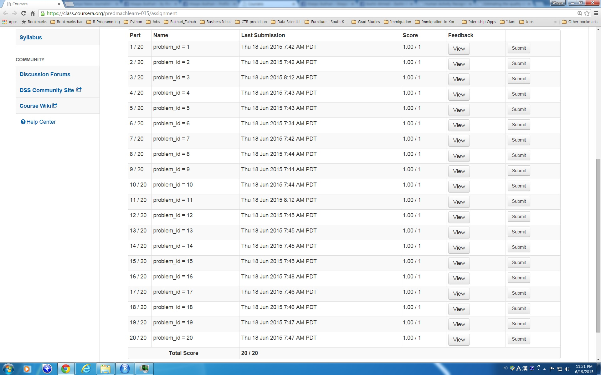

In this report, we develope prediction algorithms for estimating the quality of health activities. Our analysis and prediction performance is evaluated over benchmark **Human Activity Recognition** datasets that can accessed from <a href="http://groupware.les.inf.puc-rio.br/har"> this website </a>.

##Required packages and multicore processing
We utilize *caret* and *gbm* packages to make our coding efficient. For quicker analysis, we utilize multiple cores of our system which required us to load the **doParallel** package.

```{r, echo=FALSE, cache=TRUE}
setwd("D:\\PracticalMachineLearning\\project")
library(knitr)
library(caret)
library(doParallel)
cl <- makeCluster(detectCores())
registerDoParallel(cl)
```
##Loading the datasets
Firstly, we loaded the training and the testing datasets into R. We had a quick look over the training set since this dataset is used in building models. 

##Preprocessing and identifying useful features

We utilize **summary()** function to get an insight into the variables used in this dataset. Summary of the variables in the training dataset reveals that there are a lot of variables with many missing records. For each variable, we count the number of missing observations and for each row, we count the number of missing variables by using *colSums()* and *rowSums()* function. It was found that there are 67 variables with 19216 missing values i.e., for 67 variables, 98\% of the observations are missing. As is saying, **data is king**, we cannot use these variables for any useful insights. 

In addition to features with missing values, various datasets include variables that cannot differentiate between the classes. We utilize *nearZeroVar()* function to identify such variables. This function returns the index of such variables. 

###Useless Variables
We identify indexes of variables with 98\% missing observations with *which()* function. We combine the indexes of such variables wtih near-zero-variability and identify them as indexes of **useless variables** that cannot be productive in the prediction task. 

##Creating new datasets
We remove the useless variables, identified from the training dataset from both the training as well as the testing dataset. Note that we also remove the first variable since it is just an observation index that always increases. These new datasets have the total number of variables reduced to 57, down from a total of 159 variables.

```{r, echo=FALSE, cache=TRUE}
# Firstly load the following functions.

# The following function converts a prediction vector into a dataframe. 
# Each class count is in respective variable of the dataframe.

dummy.vars <- function(predicted){
  predictions <- data.frame(A=rep(0,length(predicted)),B=rep(0,length(predicted)),C=rep(0,length(predicted)),D=rep(0,length(predicted)),E=rep(0,length(predicted)))
  for (counter in 1:length(predicted)) {
    if(predicted[counter] == "A") {
      predictions$A[counter] <- predictions$A[counter] + 1
    }
    
    if(predicted[counter] == "B") {
      predictions$B[counter] <- predictions$B[counter] + 1
    }
    
    if(predicted[counter] == "C") {
      predictions$C[counter] <- predictions$C[counter] + 1
    }
    
    if(predicted[counter] == "D") {
      predictions$D[counter] <- predictions$D[counter] + 1
    }
    
    if(predicted[counter] == "E") {
      predictions$E[counter] <- predictions$E[counter] + 1
    }
    
  }
  return(predictions)
}

# Now, a dataframe is stored in predictions. For each row, we find the 
#variable with maximum count and save it to corresponding location of 
#a 'factor' vector.
frame.2.vector <- function(predictions){
  pred <- rep(c("A","B","C","D","E"),length=dim(predictions)[1])
  
  for (counter in 1:dim(predictions)[1]) {
    pred[counter] <- names(which.max(predictions[counter,]))
  }
  pred <- as.factor(pred)
  return(pred)
}

training <- read.csv("training.csv")
testing <- read.csv("testing.csv")

na.count.variable <- colSums(is.na(training))
na.count.rows <- rowSums(is.na(training))

# Identifying useless variables
missing.variables <- which(na.count.variable==19216)
names(missing.variables) <- NULL
low.variability.variables <- nearZeroVar(training, saveMetrics = FALSE)

useless.variables <- unique(c(missing.variables,low.variability.variables))

#table(training$classe)
# typical useless variable looks like this.
#t(table(training$classe,training[,low.variability.variables[47]]))
# Creating a new training data, removing the useless variables
new.training <- training[,-c(1,useless.variables)]
new.testing <- testing[,-c(1,useless.variables)]
```

###Why not PCA?
In our new dataset, we found that though the variables are correlated, their relation with respect to the classes is nonlinear. Therefore, it is not a good idea to apply *PCA* to further reduce the dimensionality since it is a linear transformation. As an example, we draw a scatter plot between two variables and color the samples by their respective class. In the figure below, it is clear that there are nonlinear structures in the data that cannot be possibly captured with the linear PCA. 


```{r, echo=FALSE}
# Creating a new training data, removing the useless variables

plot(new.training[,13],new.training[,21], col=new.training[,58])

```

##Creating training, testing and validation datasets
For model building over the training dataset, we split the training dataset into 60\% training, 20\% testing and 20\% validation datasets. We make this partition by utilizing *createFolds()* function and create 5 folds. We assign 3 of them to the training data and 1 to each of the testing and the validation datasets. 

```{r, echo=FALSE, cache=TRUE}
folds <- createFolds(y=new.training$classe, k=5)

train.set <- new.training[c(folds$Fold1,folds$Fold2,folds$Fold3),]
test.set <- new.training[folds$Fold4,]
valid.set <- new.training[folds$Fold5,]
```

###Assessing Out of sample accuracy over validation set
We utilize the training set with 60\% of the data for model building. Since a model would be trained over this data, model performance over this data will be very good. In order to assess the model performance, we would utilize the test set that contains 20\% of the data. We build multiple models over the training set and test all of them over the test set. The best model amongst the tested models is then chosen. Note that the best model is chosen out of its performnace over the test set, therefore, test set is also considered part of the training data. 

The best model is then used to make predictions over the validation set that contains 20\% of the data. Since the validation set is not utilized in the process of model building, the performance of the model over validation set is taken as the model estimate of **out of sample** accuracy. 


##Prediction model

Our prediction model is based on the **ensemble** of 10 models and the final prediction is decided based on the **majority vote**. 

###Basic model
Let us first describe a basic model that can become 1 of the 10 models in the **ensemble**. We randomly choose 10 variables and 1000 observations in the training set. Recall that this set consist of 60\% of the original training set. Using 1000 observations, we construct a model using **stochastic gradient boosting** algorithm. The constructed model is then tested over the testing data. Recall that this testing data consist of 20\% of the original training dataset. Based on the model performance over the test set, we decided whether the model can be a part of the ensemble. If the model yields both the **sensitivity** and **specificity** of more than 0.7 for each of the 5 classes, it becomes the a **basic model** that is the part of the **ensemble**. 

A model with 10 variables and 1000 observations can have irrelevant variables or its rows can consist of outliers. Assessing its performance over the test set ensures model's real promise. 

###Formation of ensemble and predictions
An ensemble consist of 10 basic models constructed using the procedure,as described in the previous subsection. 
For making a prediction over a new input, each model in the ensemble is utilised to make a prediction. The final prediction is decided based on the **majority vote**. Our prediction algorithm as described can be achieved in the following *R* code.

###**Out of sample accuracy** over validation set
Once the ensemble is constructed using 10 **Basic models**, we use the ensemble to test the performance over validation set. Recall that validation set consist of 20\% of the original training set. We consider the performance of our ensemble prediction approach over this validation set to assess the **Out of sample accuracy**. We compute the confusion matrix of predictions over the validation set as follows. 
```{r, echo=FALSE, cache=TRUE}


#First training session
sub.training <- train.set
sub.testing <- test.set
sub.validating <- valid.set


testing.predictions <- data.frame(A=rep(0,dim(new.testing)[1]),B=rep(0,dim(new.testing)[1]),C=rep(0,dim(new.testing)[1]),D=rep(0,dim(new.testing)[1]),E=rep(0,dim(new.testing)[1]))
valid.predictions <- data.frame(A=rep(0,dim(sub.validating)[1]),B=rep(0,dim(sub.validating)[1]),C=rep(0,dim(sub.validating)[1]),D=rep(0,dim(sub.validating)[1]),E=rep(0,dim(sub.validating)[1]))

count <- 0
while (count < 10){
  total.vars <- dim(sub.training)[2]
  train.length <- dim(sub.training)[1]
  
  
  selected.vars <- sample(1:total.vars-1, size = 10, replace = FALSE)
  selected.rows <- sample(1:train.length, size = 1000, replace = FALSE)
  
  sub.train <- sub.training[selected.rows,c(selected.vars,total.vars)]
  
  
  modFit <- train(classe ~. , method="gbm",data = sub.train, verbose=FALSE)
  
  test.pred <- predict(modFit, sub.testing[,c(selected.vars,total.vars)])
  # Compute the accuracy of model over test predictions.
  test.conf.mat <- confusionMatrix(test.pred,sub.testing$classe) #
  overall.stat <- test.conf.mat[4]
  matrix.stat <- overall.stat$byClass
  numb.state <- sum(matrix.stat[,1:2] > 0.7)
  #print(numb.state)
  
  if (numb.state == 10 ) {
    count <- count + 1
    #sub.training <- sub.training[-selected.rows,]
    # Only in this case, we can use this model to evaluate the validation set and the test set
    valid.pred <- predict(modFit, sub.validating[,c(selected.vars,total.vars)])
    valid.predictions <- valid.predictions + dummy.vars(valid.pred)
    
    testing.pred <- predict(modFit, new.testing[,c(selected.vars,total.vars)])
    testing.predictions <- testing.predictions + dummy.vars(testing.pred)
  }
  
}


valid.final <- frame.2.vector(valid.predictions)
testing.final <- frame.2.vector(testing.predictions)
# Move now from dataframe to a vector
confusionMatrix(valid.final,sub.validating$classe)#
```

Note that the overall **Out of sample accuracy** is 98\% and the **sensitivity** for each of the 5 classes is more than 96\% and **specificity** for each of the 5 classes is more than 99\%.

##Predictions over the test set
We can consider the performance of our ensemble approach over validation set to be its estimated performance over the test set. This algorithm was utilised for predictions over the test set with 20 observations. Our algorithm yielded 100\% accuracy rate over the unseen test examples. My test score page is attached.
<br>

<br>
